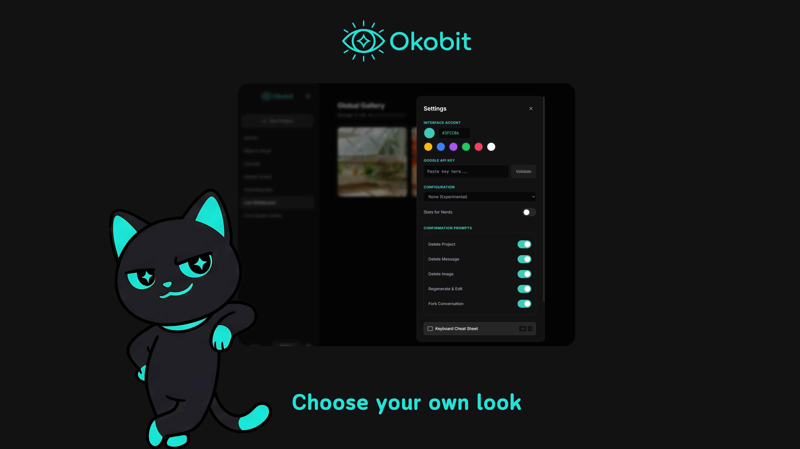
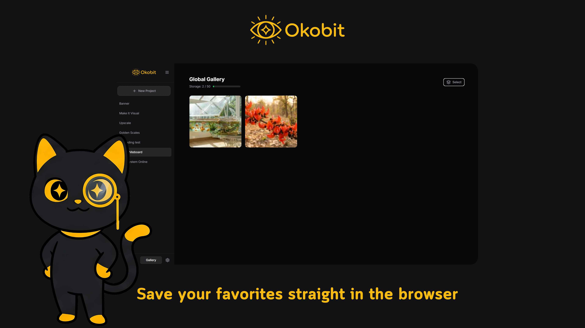

# Okobit  
A (slightly) less cumbersome way to use **Nano Banana Pro**.


**BYOK (Bring Your Own Key).**  
*Mobile friendly. Zero backend. Runs entirely client-side.*  
Try it instantly at: **https://okobit.netlify.app/**

---

## Overview  
Okobit is a **BYOK** (Bring Your Own Key), local-first, private, browser‑based interface for generating and editing images with **Gemini 3 Pro Image**, A.K.A. Nano Banana Pro.

It gives you a streamlined chat workflow, high-quality image generation, a global gallery, editing tools, prompt history, data import/export, and full offline persistence through IndexedDB.

Everything runs **in your browser**.  
Your API key stays on your device and is used only for direct model calls.

---

## Key Features


### BYOK (Bring Your Own Key)
- You provide your own Google API key  
- Key is stored locally in the browser  
- No servers or accounts involved  
- No traffic goes anywhere except directly to Google’s model endpoints

### Image Generation (Gemini 3 Pro Image)  
- Clean, fast chat-style workflow  
- Streaming text feedback  
- Attach multiple files  
- Aspect ratio and resolution controls    
- Automatic image resizing and thumbnail creation  

### Conversational UI 
- Full conversational context  
- Project-based history  
- Automatic titles  
- Edit, retry, fork, and regenerate  
- Optional detailed stats for nerds (seconds to completion, process finish code, token/cost estimation)


### Project Management  
- Unlimited projects  
- Pin, rename, delete, fork  
- Auto-persisted in IndexedDB  
- Fast switching with keyboard shortcuts  



### Image Management  
- Message-attached images  
- Global gallery with bookmarking  
- 50-image performance-conscious cap  
- Lightbox with zoom, pan, and keyboard nav  
- Bulk select, delete, unbookmark, ZIP download  
- Automatic cleanup of unreferenced images
- 


### Prompt Workflow  
- “Magic Prompt” enhancement (Using Gemini 2.5 Flash Lite for cost effectiveness and speed)  
- Recent and Saved prompt tabs  
- Multi-select for cleanup  
- One-click insertion into chat  

### File Attachments  
Supports:  
- images 
- PDFs  
- text/code formats  

### Data Portability  
- Export full backup to ZIP  
- Import/merge backups  
- Thumbnail regeneration  
- Preserves timestamps and gallery state  
- Optional full factory reset

### Mobile Friendly  
- Adaptive layout  
- Touch-friendly lightbox  
- Sidebar auto-collapses  
- Smooth input and scrolling experience  

---

## Use Online (Instant, No Install)

Run Okobit directly at:  
**https://okobit.netlify.app**

100% BYOK and client-side.  
Your API key and all data stay on your device.

---

## Run Locally

### Requirements  
- Node.js (18+ recommended)

### Setup

```bash
npm install
```

Create `.env.local`:

```
GEMINI_API_KEY=your_api_key_here
```

Start development server:

```bash
npm run dev
```

Build for production:

```bash
npm run build
npm run preview
```

---

## How to Use

### 1. Bring Your Own Key  
Okobit requires your personal Google API key.  
You enter it on first launch.  
It is stored **locally only** and never sent to any server except Google’s model endpoints.

### 2. Create or Select a Project  
Each project represents one conversation and its image generations from **Gemini 3 Pro Image**.

### 3. Attach Files  
Drag them in or use the paperclip.  
Large images are resized automatically.

### 4. Generate Images  
Click **Generate** to produce images with Gemini 3 Pro Image.  

### 5. Save Results  
Bookmark images to add them to the global gallery.

### 6. Edit and Regenerate  
You can:  
- edit past prompts  
- change or add attachments  
- regenerate responses  
- fork conversations into new projects  

### 7. Backup or Restore Data  
In Settings you can:  
- export a full ZIP  
- import/merge a backup  
- tweak customization settings  
- factory reset everything  

---

## Architecture  
- **React 19**  
- **Vite**  
- **Dexie.js** (IndexedDB)  
- **TailwindCSS**  
- **JSZip**  
- **@google/genai**

---

## Privacy  
Okobit is a **client-side BYOK tool**.  
No accounts.  
No external storage.  
No telemetry.  
Your data remains *yours* unless you choose to export it.

---

## Contributing  
Issues and PRs welcome.

---

## License  
MIT. Feel free to modify and redistribute.
